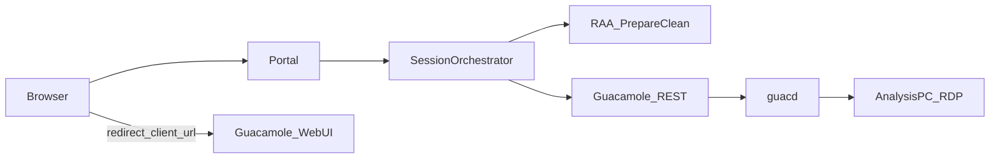

# Remote Analysis — Guacamole Architecture (Phase 3)

## Principle

Portal owns identity, booking, workspace, authorization, session lifecycle, and audit.  
Apache Guacamole is an **RDP transport gateway only**.  
Remote Analysis Agent prepares/cleans workstations and reports health — it does **not** host Guacamole.

## Lifecycle

1. Booking eligible → reservation + workspace ready  
2. `POST /api/v1/bookings/{id}/analysis/launch/` creates/reuses `RemoteDesktopSession`  
3. Agent `PREPARE_WORKSTATION` → InputReady gate → ephemeral Guacamole user + RDP connection  
4. Portal one-time launch token → `/session/{id}/connect/?t=…&redirect=1`  
5. Browser redirects to Guacamole `#/client/{id}?token=…`  
6. Idle / max duration / terminate → destroy Guac objects → COLLECT → CLEAN → release  

## Authorization (Phase 3)

At create and launch:

- Booking eligibility (`BookingAnalysisEligibilityService`) when a booking is linked  
- Active reservation + assigned workstation  
- Owner-only launch  
- Analysis window (with early-access buffer before `requested_start`)  
- `single_active_session_per_booking` (default True)  
- Global `max_concurrent_sessions`  

Rejections are audited (`SessionAuthzRejected` / `LaunchRejected`) with reason and client IP.

## HTML launcher

`/api/v1/bookings/{id}/analysis/desktop/?view=html`  
Shows **Launch Remote Analysis** only when eligible + workspace + workstation + Guacamole ready (or mock).

## Code map

| Area | Path |
|------|------|
| Orchestrator | `iic_booking/remote_analysis/guacamole/session.py` |
| Authz gates | `iic_booking/remote_analysis/guacamole/authorization.py` |
| Guac client | `iic_booking/remote_analysis/guacamole/client.py` |
| Booking bridge | `iic_booking/equipment/remote_analysis_integration/` |
| Settings | `RemoteAnalysisSettings` |

## Backward compatibility

- Default `mock_guacamole=True`  
- Sync commissioning / SAT-05 unchanged  
- Additive API fields only (`launch_url`, `launcher_url`, …)  

See also: [Documentation/BrowserRemoteDesktop.md](../Documentation/BrowserRemoteDesktop.md)
