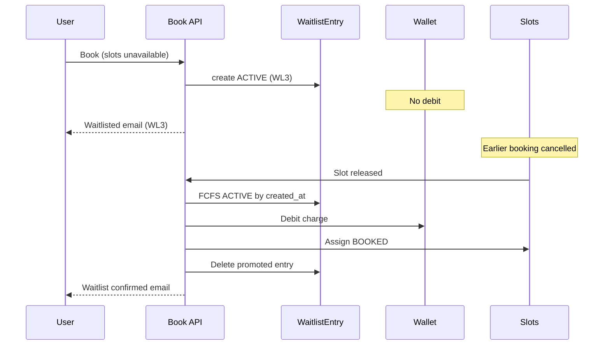

# Waitlist Policy & Workflow Specification

**Document type:** Technical and functional analysis of the *current* implementation  
**Scope:** Equipment Booking Portal — waitlist lifecycle  
**Codebases:** `iic-booking-backend`, `iic-booking-frontend`  
**Date:** 2026-07-29  
**Status:** Analysis only — no code changes in this deliverable  

---

## Executive summary

The waitlist is implemented as a **separate queue entity** (`WaitlistEntry`), not as a persisted `Booking` with status `WAITLISTED`. Users see synthetic “waitlisted booking” rows in My Bookings. **No wallet debit or hold occurs while waitlisted.** Wallet is charged only when the entry is **auto-promoted** to a real `BOOKED` booking (FCFS). Soft **opt-out** (`OPT_OUT`) is implemented: the row is retained for audit, excluded from promotion, and the ACTIVE queue compresses dynamically. Sample submission while waitlisted is supported and copied onto the booking at promotion.

---

## Architecture overview

```
┌─────────────────┐     book fails / no slots      ┌──────────────────────┐
│  User book API  │ ─────────────────────────────► │   WaitlistEntry      │
│  (FCFS + quota) │   if depth > 0 & room          │   status=ACTIVE      │
└────────┬────────┘                                │   (no Booking row)   │
         │ success                                 │   (no wallet debit)  │
         ▼                                         └──────────┬───────────┘
┌─────────────────┐                                           │
│ Booking BOOKED  │◄── FCFS promote on slot release ──────────┤
│ + wallet debit  │                                           │
└─────────────────┘                                           │
                                                              ▼
                                                   OPT_OUT / CANNOT_FULFILL
                                                   (kept; not promoted)
```

| Concept | Implementation |
|--------|----------------|
| Queue row | `WaitlistEntry` (`equipment` + `user`, unique together) |
| Position | **Computed** over `ACTIVE` rows ordered by `created_at` → `WL{n}` |
| Depth | `Equipment.waitlist_queue_depth` (0 = disabled) |
| Confirmed booking | Real `Booking` with `status=BOOKED` |
| Synthetic waitlist UI | My Bookings merges waitlist entries as `status=WAITLISTED`, `is_waitlist_entry=true` |
| Enum `BookingStatus.WAITLISTED` | Exists for events/UI; **almost never a stored Booking row** |

---

## 1. Booking flow

### 1.1 Slot availability

- Daily slots are generated from Slot Masters for date ranges (weekly calendar).
- A bookable slot typically has `DailySlot.status = AVAILABLE` and must pass:
  - Internal vs external availability rules
  - Home / non-home department reservation rules
  - Equipment weekly view time window (`weekly_view_time_from` / `to`)
  - Holidays / blocked / maintenance / operator-absent states
- External slots may be subject to `external_slot_quota_percent` and related reservation flags.

### 1.2 Quotas

- Equipment Group quotas (weekly/monthly) and per-user / faculty constraints apply at **booking time**.
- Charge profiles are per equipment + user type (Student, Faculty, External, etc.).
- **FCFS does not bypass quotas.** On waitlist promotion, the same charge-profile resolution, balance checks, and slot eligibility checks run again (`create_booking_for_waitlist_user`). If they fail, the entry is marked `CANNOT_FULFILL` (not left ACTIVE for silent retry).

### 1.3 FCFS vs quotas

| Stage | Behaviour |
|-------|-----------|
| Direct book | First successful request that passes availability + quota + wallet wins the slot(s). |
| Waitlist join | Occurs when book fails (or explicit “join waitlist” / peak-window path) and depth allows. |
| Waitlist promote | ACTIVE entries ordered by `created_at`; each is offered released/available slots in that order. Quota/wallet failures mark `CANNOT_FULFILL`. |

### 1.4 Outcomes of a book attempt

| Outcome | When | Wallet | Persistence |
|---------|------|--------|-------------|
| **Confirmed (`BOOKED`)** | Slots available; validations pass | Debited immediately (if charge &gt; 0) | `Booking` + slots `BOOKED` |
| **Hold (`HOLD`)** | Hold-booking flows | Usually not charged as normal book | Temporary hold booking |
| **Pending payment** | External partial payment paths | Partial / pending | Special statuses |
| **Waitlisted** | Book failed; waitlist enabled; ACTIVE count &lt; depth | **None** | `WaitlistEntry` ACTIVE |
| **Rejected / failed** | Validation failure; or waitlist full / disabled | None | Optional `BookingAttemptLog` |

### 1.5 Waitlist position assignment

- Position is **1-based count** of ACTIVE entries with `created_at <= this.entry.created_at`.
- Display code: `WL1`, `WL2`, … (`_format_waitlist_code`).
- Virtual display ID ends with `W` (e.g. `CHSEM202600042W`).

### 1.6 Queue depth enforcement

- `waitlist_queue_depth <= 0` → waitlist disabled; user not added.
- ACTIVE count `>= depth` → not added; API may return `waitlist_full: true`.
- **Known inconsistency:** some “full” checks historically counted **all** `WaitlistEntry` rows (including OPT_OUT / CANNOT_FULFILL), while capacity uses **ACTIVE only**. ACTIVE-based room checks were fixed for weekly slot payload; verify `waitlist_full` in `_enrich_failed_booking_response` still matches ACTIVE-only semantics.

---

## 2. Waitlist queue management

### 2.1 Queue creation

1. User attempts book (or requests waitlist without slots).
2. On failure, `_enrich_failed_booking_response` may call `add_user_to_waitlist`.
3. If added: `WaitlistEntry(equipment, user, status=ACTIVE)`, email `booking_unsuccessful_waitlist_email` with position.
4. Inputs for later promotion are reconstructed from the latest **failed** `BookingAttemptLog` for that user/equipment.

### 2.2 WL1, WL2, WL3…

- Assigned by FIFO `created_at` among **ACTIVE** only.
- Rejoin from OPT_OUT / CANNOT_FULFILL (if room): status → ACTIVE, `created_at` bumped to **end** of queue.

### 2.3 Immutable vs dynamic positions

**Dynamically recalculated** on every read. There is **no stored position column**.  
When WL2 opts out or is promoted, former WL3 becomes WL2 automatically. **Users are not re-notified of the new number.**

### 2.4 Cancellations → queue

| Event | Effect on waitlist |
|-------|-------------------|
| Confirmed booking cancelled / refunded / slots released | `schedule_waitlist_slots_available_after_commit` → FCFS promote (or short-notice email if inside `reschedule_hours_threshold`) |
| Waitlisted user opts out | Soft OPT_OUT; ACTIVE positions compress |
| Admin “clear queue” | Hard delete of waitlist rows for equipment |

### 2.5 Increasing slot availability

- Admin/OIC marks slots AVAILABLE, or capacity appears after disruption resolution → same FCFS path.
- Multiple slots free at once: promotion loop assigns as many ACTIVE users as slots (and reduced requirements) allow, in FIFO order, in one run.

### 2.6 Multiple cancellations / multi-slot release

```
Slot release (commit)
    → notify_waitlist_slots_available(preferred_slot_ids)
        → for each ACTIVE entry (FIFO):
            try create_booking_for_waitlist_user(...)
            success → delete WaitlistEntry; next
            fail fit/business → mark CANNOT_FULFILL
```

Parallel releases are serialized by DB transactions / `select_for_update` on slots.

### 2.7 Sequence (happy path)



---

## 3. Wallet deduction policy

### 3.1 Confirmed booking (direct)

| Question | Answer (current) |
|----------|------------------|
| Deducted immediately? | **Yes** (same atomic transaction as creating `BOOKED`) |
| Reserved / blocked? | **No** separate reserve; immediate debit |
| Reversible? | Via cancellation/refund flows that **credit** the wallet |

### 3.2 Waitlisted booking

| Question | Answer (current) |
|----------|------------------|
| Charge deducted on join? | **No** |
| Amount blocked/reserved? | **No** |
| Transaction until confirmation? | **None** |

Implication: balance can drop while waitlisted; promotion may fail with insufficient funds → `CANNOT_FULFILL`.

### 3.3 On promotion

- Balance re-checked; then `debit` with booking description.
- Faculty wallet: student bookings may debit faculty sub-wallet (same as normal book).
- Represented as a normal wallet debit transaction tied to the new booking.
- Refundable later under confirmed-booking cancellation/refund rules.

---

## 4. Promotion from waitlist

### 4.1 Triggers

- User/staff cancellation releasing slots  
- Refund releasing slots  
- Reschedule releasing old slots  
- Hold release  
- Admin/OIC marking slots AVAILABLE  
- Slot window / reference-time clear job (attempts FCFS then may clear remaining)  
- Operator unavailable (full ABSENT path that frees slots)  

### 4.2 Order

ACTIVE only, `order_by("created_at")` (FIFO).

### 4.3 Processing

1. Resolve available slots (prefer released IDs when provided).  
2. Rebuild inputs from last failed attempt; optionally **reduce** sample/duration to fit available slots.  
3. Create booking: debit → `BOOKED` → assign slots.  
4. Copy waitlist sample → `BookingSampleTrace(SAMPLE_SENT)` if submitted while queued.  
5. Delete successful `WaitlistEntry`.  
6. Send `booking_waitlist_confirmed_email` (booker + wallet owner if different).  
7. Booking events: synthetic Waitlisted→Booked narrative + CREATED.  

### 4.4 Short notice

If released slot start is inside `equipment.reschedule_hours_threshold`:  
**do not auto-book**; email `waitlist_short_notice_slot_available_email` instead.

### 4.5 Timestamps / audit

- Booking `created_at` = promotion time (not original waitlist join time).  
- Join time preserved in email metadata / event comments when available.  
- Failed promote → `CANNOT_FULFILL` + remark + `marked_cannot_fulfill_at`.

---

## 5. Waitlist cancellation vs opt-out

### 5.1 User “Leave Waitlist” (current)

Implemented as **soft opt-out**, not hard delete:

| Aspect | Behaviour |
|--------|-----------|
| Status | `OPT_OUT`, `opted_out_at` set |
| Queue | Removed from ACTIVE; positions of others recalculate |
| Wallet | No change |
| Notification | `waitlist_opt_out_email` |
| Booking row | None existed; none created |
| Admin visibility | Shown on Equipment Waitlist as Opted out |

### 5.2 Historical note

Earlier versions **deleted** the waitlist row on cancel. Current portal button label: **Leave Waitlist**.

---

## 6. Waitlist opt-out (detail)

**Implemented** (backend + UI).

| Field | After opt-out |
|-------|----------------|
| Booking status | N/A (no Booking); synthetic UI removes ACTIVE entries from My Bookings active list |
| Queue | Compressed for remaining ACTIVE |
| Wallet | Unchanged |
| Future promotion | **Never** (unless user rejoins when depth allows) |
| Sample on entry | Retained on OPT_OUT row for audit; not used for promotion |

---

## 7. Cancellation policy

### 7.1 Confirmed bookings

| Actor | Typical path | Refund |
|-------|--------------|--------|
| Booking user | `user_cancel_booking` | Full cancel with refund subject to rules; blocked inside `reschedule_hours_threshold` before start (with disruption exceptions) |
| Lab In-charge / OIC / Admin | Staff cancel | Refund flag in request (default often **false** for staff) |
| Partial cancel | Reduce samples/slots/print files | Partial wallet credit = old charge − new charge |

Statuses after full cancel: `CANCELLED`, `REFUNDED`, or disruption statuses (`ABSENT`, `UNDER_MAINTENANCE`, `OTHER_DISRUPTION`) depending on path.

### 7.2 Waitlisted

| Action | Wallet | Queue |
|--------|--------|-------|
| Leave Waitlist (opt-out) | None | Soft OPT_OUT |
| Admin clear queue | None | Hard delete |

No “refund” applies because nothing was charged.

### 7.3 Administrative cancellation (confirmed)

| Role | Capability (approx.) |
|------|----------------------|
| Main Admin | Full staff cancel / refund / slot ops |
| Dept Admin | Scoped by department permissions |
| OIC (Manager) | Managed equipment; may cancel started slots |
| Lab In-charge (Operator) | Operator permissions; some actions restricted (e.g. certain refunds) |

Exact RBAC is module/permission based; waitlist staff page is Admin / OIC / Lab In-charge.

---

## 8. Refund policy (summary)

| Scenario | Typical wallet | Slots | Waitlist |
|----------|----------------|-------|----------|
| User cancel with refund | Full / partial credit | Released | FCFS triggered |
| Staff cancel without refund | No credit | Released | FCFS triggered |
| Booking Not Utilized | **No refund** | Marked not utilized (not freed for waitlist) | No promote |
| Operator Unavailable (full ABSENT) | Full credit | Freed | FCFS (respect threshold) |
| Staff disruption pending | Deferred; user later chooses | Pending | Later |
| Under maintenance auto-cancel | Full credit | Freed | FCFS |
| Waitlist opt-out / clear | N/A | N/A | Remove from ACTIVE |
| Waitlist pre-reference clear | N/A | N/A | FCFS then delete remaining |
| Promote then later cancel | Same as confirmed | Released | FCFS for others |

---

## 9. Sample submission

| Question | Current behaviour |
|----------|-------------------|
| Can waitlisted users submit samples? | **Yes** — `POST /waitlist/<id>/submit-sample/` while ACTIVE |
| Until when? | While ACTIVE (no hard “slot start” gate on waitlist API; they have no assigned slot yet) |
| Acceptance before confirmation? | Lab processes sample lifecycle on a **Booking**. Pre-promote, sample is only on `WaitlistEntry`. Staff see “Sample Submitted / Waiting for Confirmation” on Equipment Waitlist |
| On promotion | `BookingSampleTrace` created as `SAMPLE_SENT` |
| Never promoted / opted out | Sample flags remain on waitlist row; no booking lifecycle. Operational handling of physical samples is outside auto-workflow |
| UI safeguard | Amber banners: do not mark Not Utilized merely because waitlisted / awaiting confirmation |

---

## 10. Status lifecycle

### 10.1 Confirmed booking (simplified)

```
BOOKED
  → sample traces: SAMPLE_SENT → … → COMPLETED / RETURNED / DISPOSED / …
  → or CANCELLED / REFUNDED / BOOKING_NOT_UTILIZED / ABSENT / …
```

### 10.2 Waitlist track (actual persistence)

```
(no Booking)
WaitlistEntry ACTIVE
  → BOOKED (new Booking; entry deleted)     [promotion]
  → OPT_OUT                                  [leave waitlist]
  → CANNOT_FULFILL                           [auto-book failed]
  → deleted                                  [admin clear / pre-ref clear]
```

### 10.3 UI synthetic statuses

| Display | Meaning |
|---------|---------|
| Waiting List / WL{n} | ACTIVE entry |
| Opted Out | OPT_OUT |
| Waitlist — Cannot Fulfill | CANNOT_FULFILL |
| Confirmed / Booked | Real booking after promote |

---

## 11. Notification policy

| Event | Channel | Template / mechanism |
|-------|---------|----------------------|
| Added to waitlist | Email | `booking_unsuccessful_waitlist_email` |
| Promoted to confirmed | Email | `booking_waitlist_confirmed_email` (+ wallet owner) |
| Opt-out | Email | `waitlist_opt_out_email` |
| Short-notice slot (no auto-book) | Email | `waitlist_short_notice_slot_available_email` |
| Queue position changed | — | **Not sent** |
| Generic “slots available” | — | Template `waitlist_slots_available_email` exists; **not used** in current FCFS path |
| SMS / WhatsApp | — | Not part of waitlist flow |
| In-app | Partial | My Bookings / toasts; no dedicated push queue |

---

## 12. Administrative visibility

| Surface | Waitlist position | Opt-out | Sample submitted | Awaiting confirmation | Wallet |
|---------|-------------------|---------|------------------|----------------------|--------|
| Equipment Waitlist page | Yes (`WL{n}`) | Yes | Yes | Yes | Via attempt log / promote time only |
| My Bookings (user) | Yes (ACTIVE) | Filtered out of active list | Yes on detail | Yes | N/A until promote |
| Booking Management | **No** merge of ACTIVE waitlist into booking grid | — | After promote only | — | Normal booking |
| Calendar | Confirmed bookings/slots | — | — | — | — |
| Sample lifecycle UI | Hidden for pure waitlist entry; enabled after promote | — | Waitlist form + staff columns | Banner | — |
| Reports | Booking-centric | Waitlist not first-class | — | — | Wallet reports separate |

**Gap:** Lab/OIC booking management screens do not show waitlisted users as first-class bookings alongside confirmed ones (only the dedicated Waitlist page).

---

## 13. Audit trail

| Event | Logged? |
|-------|---------|
| Join waitlist | `WaitlistEntry` row + failed `BookingAttemptLog` + email send attempt |
| Promote | Booking + wallet debit + booking events + entry delete |
| Opt-out | Status/fields on entry + email |
| CANNOT_FULFILL | Status + remark + timestamp |
| Slot release → FCFS | Application logs; booking events on success |
| Position reorder | Implicit only (no event per compression) |
| Admin clear | Delete + API response |

---

## 14. Edge cases (current behaviour)

| Scenario | Behaviour |
|----------|-----------|
| Queue full | Not added; failure response; may flag `waitlist_full` |
| Multiple cancellations | Each release schedules FCFS; FIFO consumes freed slots |
| Multiple slot increases | One FCFS run can confirm multiple ACTIVE users |
| Wallet drops while waitlisted | Promote fails → CANNOT_FULFILL |
| User disabled | Promote / book paths fail eligibility |
| Equipment waitlist depth → 0 | New joins stop; existing ACTIVE remain until promote/clear/opt-out |
| Booking window / pre-reference | Celery `clear_waitlist_due_before_reference`: try FCFS, then **delete remaining** |
| User already has another booking | Not inherently blocked by waitlist unique(equipment,user) alone; other business rules may apply at book/promote |
| Sample submitted, never promoted | Entry may OPT_OUT / CANNOT_FULFILL / cleared; sample data stays on entry; physical sample ops manual |
| Opt-out immediately before promote | Race: if still ACTIVE at FCFS read, may still promote; if OPT_OUT committed first, skipped |
| Unique (equipment, user) | One row per user per equipment; rejoin reactivates same row |

---

## 15. Missing functionality / inconsistencies

### Critical

1. **No wallet reserve while waitlisted** — users may be unable to pay at promotion; marked CANNOT_FULFILL.  
2. **Booking Management does not surface waitlist** — staff may miss WL + sample-submitted cases if they only use booking grids.  
3. **`waitlist_full` vs ACTIVE depth** — verify all call sites use ACTIVE-only counts.  
4. **CANNOT_FULFILL after failed promote** — older comments suggested retry; code removes from ACTIVE until manual rejoin.  
5. **Pre-reference clear deletes remaining waitlist** — abrupt expiry without dedicated “expired” status or user email in all cases.

### Recommended

6. **No notification when WL position improves** after others opt out / promote.  
7. **Unused** `waitlist_slots_available_email` template.  
8. **No persisted `Booking` WAITLISTED** — complicates sample acceptance, Not Utilized, and reporting vs intended “booking recorded” language.  
9. **Promotion timestamp ≠ join time** — audit/reporting of “when requested” relies on waitlist `created_at` / attempt logs.  
10. **External users** — frontend may disable waitlist intent; confirm product intent.

### Nice-to-have

11. In-app / SMS waitlist alerts.  
12. Explicit “Expired” waitlist status instead of delete.  
13. Admin UI to re-activate CANNOT_FULFILL / force promote.  
14. Reports: waitlist depth utilization, promote success rate, opt-out rate.

---

## 16. Recommendations

| Area | Existing | Proposed |
|------|----------|----------|
| Fairness | FIFO ACTIVE by `created_at` | Keep; notify on position change; keep CANNOT_FULFILL out of ACTIVE |
| Wallet | Debit only on promote | Optional soft hold/authorize at join; release on opt-out; capture on promote |
| Refund | N/A on waitlist; normal rules after BOOKED | Document clearly in UI: “No charge until confirmed” |
| Notifications | Join / confirm / opt-out / short-notice | Add position-change + expiry emails; remove or wire unused template |
| Admin visibility | Dedicated Waitlist page | Merge WL badges into Booking Management / lab dashboard |
| UX | Leave Waitlist + sample while queued | Show “Sample Submitted — Waiting for Confirmation” everywhere staff act |
| Ops | Pre-ref clear | Prefer OPT_OUT/EXPIRED + email over silent delete |

---

## Alignment with intended business rules (checklist)

| Intended rule | Current |
|---------------|---------|
| First N confirmed by FCFS + quotas | Yes (direct book) |
| Next Depth → WL1…WLn | Yes (ACTIVE FIFO, depth) |
| Beyond depth rejected | Yes |
| Auto promote + compress | Yes (delete on success; dynamic ranks) |
| Opt-out keep record, exclude promote | Yes (`OPT_OUT`) |
| Sample submit while waitlisted | Yes |
| Staff see WL / sample / pending | Partial (Waitlist page yes; Booking Management no) |
| Safeguard Not Utilized | UI banners; waitlist entries cannot be marked Not Utilized (no BOOKED row) |
| Notify assign / promote / opt-out | Yes |
| Wallet unchanged until confirm | Yes |

---

## Key source files

| Area | Path |
|------|------|
| Model | `iic_booking/equipment/models.py` — `WaitlistEntry`, `waitlist_queue_depth` |
| Queue / promote | `iic_booking/equipment/waitlist.py` |
| Auto-book + debit | `iic_booking/equipment/waitlist_booking.py` |
| Join on failed book | `api_views.py` — `_enrich_failed_booking_response` |
| Opt-out / sample API | `api_views.py` — `cancel_my_waitlist_entry`, `submit_waitlist_sample` |
| Cancel → waitlist | `booking_cancellation.py` |
| Staff API | `config/admin_api.py` — equipment `waitlist` action |
| Emails | `communication/default_email_templates.py` |
| User UI | `MyBookings.tsx`, `BookingDetailCard.tsx` |
| Staff UI | `EquipmentWaitlist.tsx` |

---

*End of analysis document. Ready for product review before any further code changes.*
