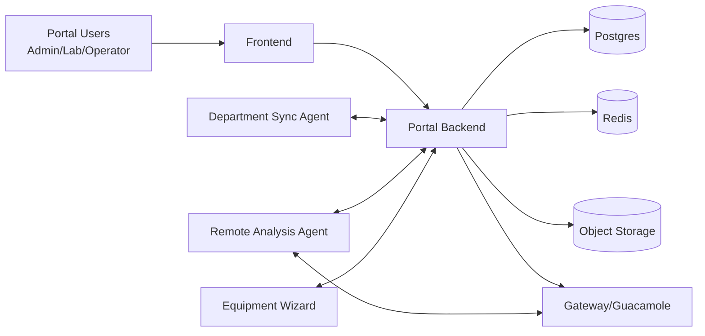
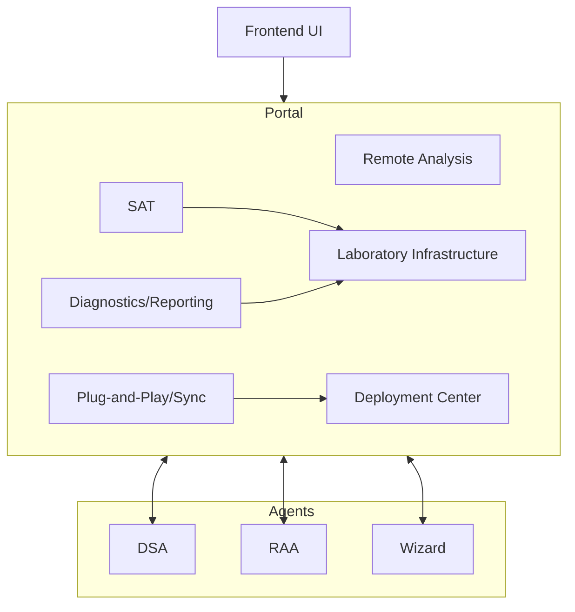
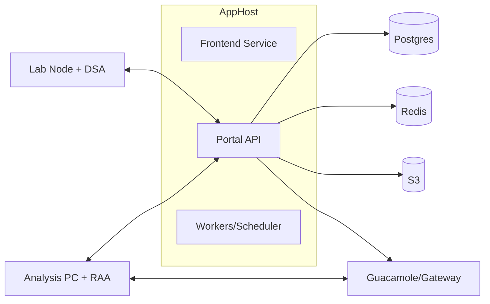
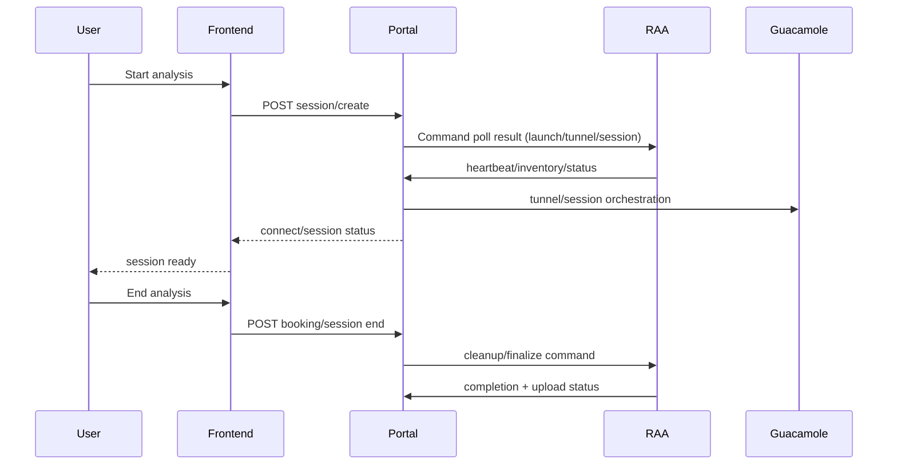
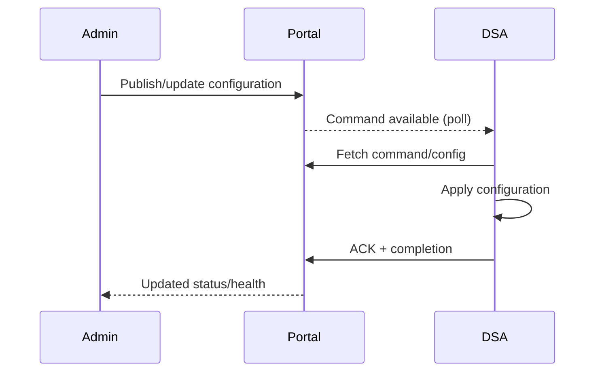

# Platform Architecture

## System Context

## Component Architecture

## Deployment Architecture

## Core Sequence: Remote Analysis Lifecycle

## Core Sequence: DSA Configuration Push

## Database Ownership

| Domain | Primary app/data owner |
|---|---|
| Remote Analysis sessions/tunnel/workspaces | `remote_analysis` + related booking/equipment links |
| Equipment RA settings | `equipment` |
| Deployment metadata and compatibility | `deployment` |
| Sync templates and reservations | `sync` |
| Lab operations and SAT models | `lab_infrastructure` |

## API Ownership

| API family | Owner |
|---|---|
| `/api/v1/analysis/*` | Backend B1/B2 (+ B6/B7 overlays) |
| `/api/v1/deployment/*` | Backend B3 |
| `/api/v1/sync/*` | Backend B4 |
| `/api/v1/lab/*` | Backend B5 (+ B6/B7 overlays) |
| DSA local `api/*` | DSA D0-D4 |
| RAA runtime + installer client to portal APIs | RAA R1-R4 |

## Message Flow Summary

1. Frontend drives user-facing lifecycle via portal APIs.
2. Portal acts as control plane and source-of-truth for state, permissions, and release metadata.
3. DSA and RAA poll/report against portal endpoints for command execution and telemetry.
4. Deployment center manages installer release distribution and compatibility signaling.

## State Transition Summary

### Remote Analysis Session (high-level)
- Requested -> Reserved -> Preparing -> Ready -> Active -> Ending -> Closed
- Failure branches: PrepareFailed, LaunchFailed, UploadFailed, Timeout, CleanupPending

### Agent Command (DSA/RAA)
- Queued -> Polled -> InProgress -> Completed/Failed -> Audited

## Version Compatibility

| Component | RC1 commit chain baseline |
|---|---|
| Portal Backend | B1-B8 |
| Frontend | F1-F4 |
| DSA | D0-D4 |
| RAA | R1-R4 |
| Wizard | Deployment/DSA-associated RC1 packaging flow |

Compatibility rule: keep `/api/v1` contract stable for this RC window; additive changes only until post-RC re-baseline.
