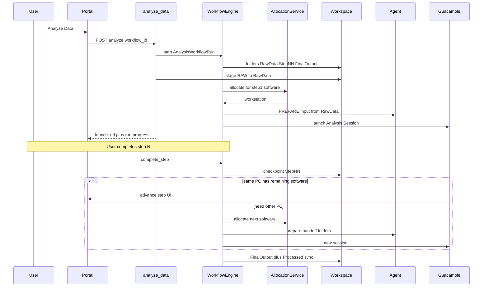

# Analysis Workflows — Implementation Plan (for approval)

**Status:** APPROVED refinements implemented (AnalysisJob, capabilities, inputs, resume, scoring, Portal UX, Designer).

See also: `docs/Analyze-Data-Guide.md` (updated for workflows + terminology).

---

## 1. Existing implementation review

| Component | Reuse |
|-----------|--------|
| `AnalysisSoftwareCatalog` | Step software FK |
| `EquipmentAnalysisSoftware` | Auto-migrate to single-step workflow; keep as legacy fallback |
| `EquipmentAnalysisPool` | Unchanged affinity |
| `AllocationService` / `SchedulerService` | Allocate **per current step** (and optional all-software same-PC filter) |
| `BookingRemoteAnalysisService.analyze_data` | Entry: resolve workflow → start run → activate step 1 |
| `BookingRawStagingService` | Stage RAW → `RawData/` |
| `AnalysisWorkspace` + `TransferManager` | One workspace per run; add step folders |
| Guacamole / Agent / sessions | Session per active step; handoff = new allocate + prepare |
| Ops toolkit / Django admin / SAT / deploy | Extend |

**Non-goals:** second scheduler, Agent redesign, renaming backend `remote_analysis` APIs, exposing Guacamole/workstation to researchers.

---

## 2. Locked design decisions

1. **Same-PC preference:** If one ONLINE PC has **all mandatory** step softwares (inventory match), allocate once and keep the user there for the whole run.
2. **Handoff:** Otherwise allocate for the **current step only**; on complete, allocate next PC, copy prior step outputs into next input folder, launch a new Analysis Session on the **same** portal workspace.
3. **One `AnalysisWorkspace` per booking analysis run** (existing model); folders grow with steps.
4. **Backward compatibility:** Each `EquipmentAnalysisSoftware` → published single-step `AnalysisWorkflow` + `EquipmentAnalysisWorkflow`. Analyze Data keeps working.
5. **Terminology (UI / emails / docs only):** Analyze Data, Analysis Workspace, Analysis Session, Analysis Environment, Processed Results. Backend/DB keep `remote_analysis` names.
6. **Workflow Designer Phase 1:** React admin page with ordered steps (up/down + add/remove; HTML5 drag-and-drop if straightforward) + Django admin CRUD.

---

## 3. Architecture (sequence)

Researchers see: Book → Experiment → **Analyze Data** → workflow progress → **Processed Results**.

---

## 4. Database model additions

New module: `iic_booking/remote_analysis/workflow_models.py` (re-exported from `models.py`).

### Definition

- **`AnalysisWorkflow`**: name, slug, description, is_active, estimated_duration_minutes
- **`AnalysisWorkflowVersion`**: FK workflow, version, changelog, is_published, published_at (immutable when published)
- **`AnalysisWorkflowStep`**: FK version, step_number, FK software→`AnalysisSoftwareCatalog`, version_constraint, mandatory, estimated_duration_minutes, expected_output_folder, description, operator_instructions, validation_rules (JSON), allowed_file_types
- **`EquipmentAnalysisWorkflow`**: FK equipment, FK workflow, is_default, sort_order, button_label_override

### Runtime

- **`AnalysisWorkflowRun`**: FK booking, workspace, reservation; FK workflow_version; status (PENDING|PREPARING|ACTIVE|PAUSED|COMPLETED|FAILED|CANCELLED); current_step_number; preferred_workstation (internal); timestamps
- **`AnalysisWorkflowRunStep`**: FK run, FK step; status (PENDING|READY|ACTIVE|COMPLETED|SKIPPED|FAILED); FK session, workstation (admin-only in responses); input_folder, output_folder; started_at, completed_at, checkpoint_at

### Settings (additive on `RemoteAnalysisSettings`)

- `analyze_data_prefer_workflow` (default True)

Migration: `0014_analysis_workflows` + data migration from `EquipmentAnalysisSoftware` → single-step workflows.

---

## 5. Workflow execution engine

New: `iic_booking/remote_analysis/services/workflow_engine.py`

| Method | Behavior |
|--------|----------|
| `resolve_workflow(equipment, workflow_id?)` | Default equipment workflow, else legacy single-step |
| `start_run(...)` | Create run + run-steps; ensure folders |
| `plan_allocation(run)` | All-mandatory softwares on one PC → pin; else per-step |
| `activate_step(run, n)` | software_profile from step → allocate → stage inputs → launch session |
| `complete_step(run, n)` | Validate outputs → checkpoint → advance or finalize |
| `skip_optional_step` | Non-mandatory only |
| `pause` / `resume` | Status; optional session terminate on pause |
| `finalize` | Promote to `FinalOutput/` + `Processed/` for Results/S3 |

Extend `analyze_data`: resolve workflow → start run → stage RAW → `activate_step(1)` → return launch_url + progress DTO (no hostname).

---

## 6. Allocation enhancements

Extend existing `AllocationService` only:

- Optional `required_software_names: list[str]` to find a PC matching **all** mandatory softwares (same-PC plan).
- Per-step calls keep today’s `requirement` / `software_profile` + equipment pool boost.
- No new scheduler service.

Handoff: release/complete current reservation as needed; allocate next profile for same booking; reuse Guacamole session create path.

---

## 7. Workspace lifecycle

On run start create:

`RawData/`, `Step01/`…`StepN/`, `FinalOutput/`, `Scratch/`, `Logs/`

Keep **`Processed/`** as alias/copy target of `FinalOutput` for Agent upload compatibility (`Output`→`Processed`).

- Step 1 input: `RawData` → Agent `Input`
- Step N input: prior `Step{N-1}` → Agent `Input`
- Step N output: Agent `Output` → `StepNN` (via prepare/collect folder map)
- Final: copy into `FinalOutput/` + `Processed/`

---

## 8. API additions

| Method | Path | Purpose |
|--------|------|---------|
| GET | `/api/v1/bookings/<id>/analysis/` | Enrich: workflow, run, progress, UX labels |
| GET | `/api/v1/bookings/<id>/analysis/workflows/` | List equipment workflows |
| POST | `/api/v1/bookings/<id>/analysis/analyze/` | Accept `workflow_id` (legacy `mapping_id` still works) |
| GET | `/api/v1/bookings/<id>/analysis/run/` | Current run progress |
| POST | `/api/v1/bookings/<id>/analysis/run/steps/<n>/complete/` | Checkpoint + advance |
| POST | `.../run/pause/` / `.../run/resume/` | |
| CRUD | `/api/v1/analysis/workflows/` (staff) | Designer |

Resolution order: `workflow_id` → default `EquipmentAnalysisWorkflow` → legacy software mapping → error.

---

## 9. Portal UX

**User (`BookingDetailCard`):** workflow picker (name, duration, steps); progress strip; Complete step / Pause; status strings per terminology list; no Remote Analysis / Guacamole / hostname.

**Admin:** Workflow Designer page (catalog-backed steps, reorder, publish, equipment mapping, default) + Django admin.

**Dashboard:** extend existing ops/scheduler views with running workflows, current step, success rate, durations.

---

## 10. Migration strategy

1. Create tables.  
2. For each `EquipmentAnalysisSoftware`: workflow `{Equipment.code} / {Software}`, v1 published, one mandatory step, equipment mapping (`is_default` preserved).  
3. Leave legacy mapping rows.  
4. Feature ships dark until workflows published (migrated rows auto-enable).

---

## 11. Security / scalability

- Same `_can_launch` / eligibility; no workstation IDs to researchers.  
- Audit: `WorkflowStarted`, `StepActivated`, `StepCompleted`, `WorkflowHandoff`, `WorkflowCompleted`.  
- Handoffs copy within workspace volume; Celery only if trees are huge (follow-up).  
- Published versions immutable.

---

## 12. Documentation

Update `docs/Analyze-Data-Guide.md`: workflows, terminology, designer, migration. Add short admin publish checklist.

---

## 13. Implementation phases (after approval only)

1. Models + migration + legacy→single-step backfill  
2. Workflow engine + allocation same-PC/handoff + workspace folders  
3. Booking analyze/run APIs + labels  
4. Frontend picker + progress + terminology  
5. Workflow Designer + Django admin  
6. Dashboard widgets + tests + docs  

---

## Compatibility checklist

- [ ] One-software equipment keeps working after migrate  
- [ ] Reservations / Guacamole / Agent contracts unchanged  
- [ ] DSA/S3 RAW staging unchanged  
- [ ] No second scheduler  
- [ ] UI terminology updated; API paths remain under `/analysis/`  

---

## Approval

Reply **approve** (or request changes) before any code is written for this plan.
