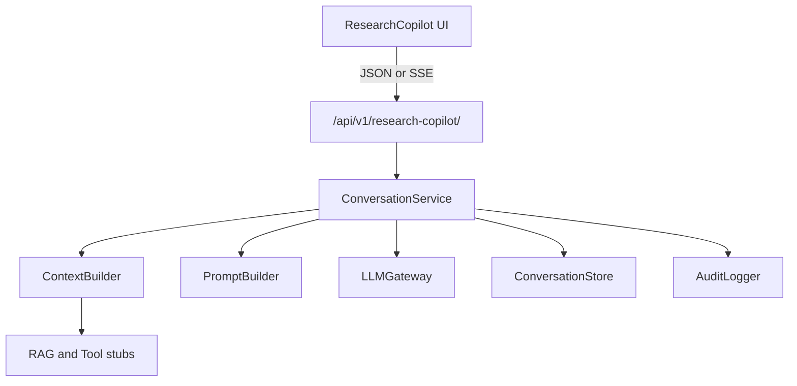

# AI.1 — IIC Research Copilot Conversation Framework

**Status:** Implemented  
**Scope:** Conversation Framework (AI.1)  
**Does not replace Help in production until flags are approved**

---

## Objective

Introduce **IIC Research Copilot** as the intelligent laboratory interface — not a generic chatbot — with:

- Role-aware prompts and context
- Persistent conversations + audit
- Streaming-ready API
- Stub hooks for RAG (AI.2) and tools/actions (AI.3–AI.4)
- Soft escalation hints (full ticket attach in AI.5)

Existing Help widget (`ChatWidget` + `POST /api/chat-agent/`) remains available.

---

## Architecture

| Layer | Location |
|-------|----------|
| Django app | `iic_booking/research_copilot/` |
| Frontend | `src/components/ResearchCopilot/` |
| Legacy Help | `src/components/ChatWidget.tsx` + `support/chat_ai.py` |

---

## Feature flags

| Flag | Where | Default | Meaning |
|------|-------|---------|---------|
| `RESEARCH_COPILOT_ENABLED` | Backend env | `false` | Gate API (503 when off) |
| `RESEARCH_COPILOT_MODEL` | Backend env | `OPENAI_CHAT_MODEL` | LLM model |
| `VITE_RESEARCH_COPILOT_ENABLED` | Frontend | unset/false | Mount Copilot FAB |
| `VITE_HELP_WIDGET_ENABLED` | Frontend | `true` | Mount Classic Help |

### Migration / coexistence

| Copilot | Help | Behavior |
|---------|------|----------|
| off | on | Production today |
| on | on | Dual FABs (Copilot primary; Help labeled Classic Help) |
| on | off | Production replacement (post-approval only) |

---

## API

Base: `/api/v1/research-copilot/` (authenticated)

| Method | Path | Purpose |
|--------|------|---------|
| GET | `bootstrap/` | Role prompts, capabilities |
| GET/POST | `conversations/` | List / create |
| GET | `conversations/{id}/` | History |
| POST | `conversations/{id}/messages/` | Send turn |
| POST | `conversations/{id}/messages/stream/` | SSE stream |
| POST | `conversations/{id}/feedback/` | thumbs up/down |

---

## Security (AI.1)

- Auth required for all Copilot endpoints
- No secrets in prompts or UI
- No cross-user booking/wallet injection (tools land in AI.3)
- Model escalate marker stripped; `escalate_hint` + knowledge gap recorded
- Audit events for create / reply / stream / feedback

---

## Tests

`iic_booking/research_copilot/tests/test_conversation_ai1.py`

- Feature disabled → 503  
- Create conversation + message (fallback LLM)  
- Guest denied  
- Human request → escalate_hint  
- Feedback  

---

## Roadmap

| Phase | Focus |
|-------|-------|
| AI.2 | Knowledge base + RAG embeddings |
| AI.3 | Tool calling (read tools) |
| AI.4 | Confirmed action execution |
| AI.5 | Support ticket escalation with transcript |
| AI.6 | Analytics dashboard |
| AI.7 | Voice + multilingual |
| AI.8 | Continuous improvement loop |

---

## Operator enablement (staging)

1. Apply migration `research_copilot.0001_initial_research_copilot`
2. Set `RESEARCH_COPILOT_ENABLED=True` and optionally `OPENAI_API_KEY`
3. Set `VITE_RESEARCH_COPILOT_ENABLED=true` and rebuild frontend
4. Keep `VITE_HELP_WIDGET_ENABLED=true` until UAT sign-off
5. After approval: set Help flag false and announce replacement
