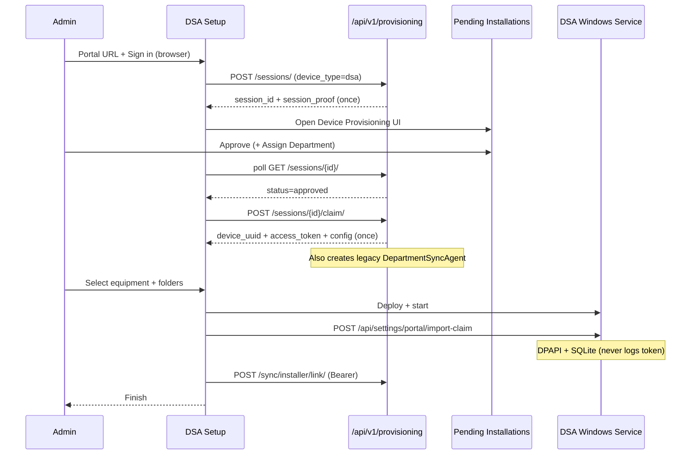

# Phase R.2.2 — Department Sync Agent Zero-Touch Enrollment

**Scope:** DSA installer + portal DSA bridge only.  
Equipment PC Wizard and Remote Analysis Agent are **unchanged**.

## Administrator experience

```
Download DSA → Run Installer → Next → Install → Sign in to Portal → Finish
```

No Agent UUID, Enrollment Secret, Bootstrap Token, or API Key on the standard path.

## Installer screens (Portal step)

1. **Portal URL** (default `https://equip.iitr.ac.in`)
2. **Sign in with Portal** / **Sign in with Channel-i** (opens system browser)
3. **Start Provisioning** → live phases:
   - Connecting to Portal
   - Waiting for Approval
   - Provisioning
   - Configuration Download
   - Enrollment Complete
4. **Retry** / **Cancel** on timeout or failure
5. **Emergency recovery** expander: legacy UUID + enrollment secret (hidden)

## Sequence



## API flow

| Step | Call | Notes |
|------|------|-------|
| Register | `POST /api/v1/provisioning/sessions/` | `device_type=dsa`, machine fingerprint |
| Poll | `GET /api/v1/provisioning/sessions/{id}/` | Header `X-Provisioning-Session-Proof` |
| Approve | Portal UI `/device-provisioning` | **Department required for DSA** |
| Claim | `POST …/claim/` | Returns Bearer once; bridges `DepartmentSyncAgent` |
| Import | Local `POST /api/settings/portal/import-claim` | Service DPAPI store |
| Link | `POST /api/v1/sync/installer/link/` | Bearer + `X-Agent-UUID` |

## Security

- Secrets never shown in installer UI, logs, or clipboard prompts
- `session_proof` / `access_token` held in memory only until import; then cleared
- Service persists Bearer with existing DPAPI protector
- Admin approve responses never include tokens
- Legacy `/api/v1/sync/enroll/` retained for emergency recovery only

## Compatibility

| Scenario | Behavior |
|----------|----------|
| Already-enrolled DSA upgrade | Skip zero-touch; reuse local token |
| Fresh install | Zero-touch required |
| Emergency recovery | Expander UUID + secret → legacy enroll |
| Silent legacy | `/agentUuid=` + `/enrollmentSecret=` |
| Silent zero-touch | `/sessionId=` + `/sessionProof=` (session pre-approved) |
| Silent upgrade | `/upgrade` |

## Tests

```bash
dotnet test Backend/tests/DepartmentSyncAgent.Installer.Tests
```

Covers silent arg parsing, secret wipe helpers, claim pack ToString guard.

Portal workflow tests remain in `iic_booking/device_provisioning/tests` (create → approve → claim).

## Migration notes

1. Deploy portal with R.2.1 provisioning + R.2.2 DSA bridge (`_bridge_dsa_agent` on claim).
2. Ship new DSA Setup build (Installer).
3. Admins use **Device Provisioning → Pending Installations**; assign **Department** before Approve.
4. Existing agents do not re-enroll.

## Code touchpoints

| Area | Path |
|------|------|
| Installer UI | `DepartmentSyncAgent.Installer/MainWindow.xaml(.cs)` |
| Provisioning client | `…/Services/PortalProvisioningClient.cs` |
| Pipeline | `…/Services/InstallPipeline.cs` |
| Claim import | `PortalSettingsController.ImportClaim` + `AgentEnrollmentService.ImportClaimAsync` |
| Portal bridge | `iic_booking/device_provisioning/services.py` `_bridge_dsa_agent` |
