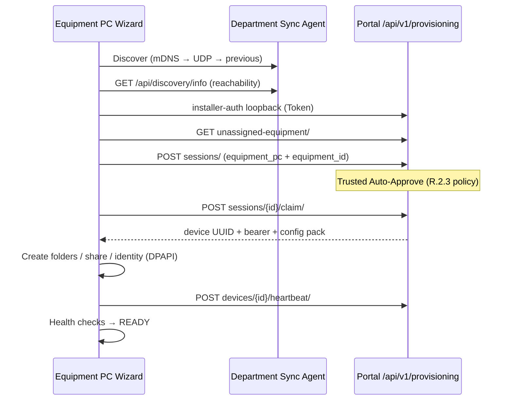

# R.2.4 — Equipment PC Zero-Touch Provisioning

**Status:** Implemented  
**Scope:** Equipment PC Configuration Wizard + portal provisioning APIs  
**Does not modify:** Remote Analysis Agent (R.2.5)

---

## Objective

Administrator experience:

```
Download Wizard → Install → Discover DSA → Login → Select Equipment → Finish
```

No UUID, API key, enrollment secret, IP/folder/network manual configuration on the standard path.

---

## Architecture



| Layer | Responsibility |
|-------|----------------|
| DSA | LAN discovery + department hint (not secret exchange) |
| Portal | Auth, unassigned equipment, session, claim pack, audit |
| Wizard | Apply folders/share locally; never install DSA/RAA |

---

## Installer flow

| Step | UI | Behavior |
|------|-----|----------|
| 1 Discover | Auto mDNS → UDP → previous | Manual IP under Advanced only |
| 2 Connect | Verify DSA + Portal + department | Select LAN NIC for identity |
| 3 Login | Portal / Channel-i loopback | Reuse DPAPI device session if present |
| 4 Equipment | `GET /unassigned-equipment/` | Only unmapped instruments |
| 5 Provision | Create session → claim → apply | Auto-approve when policy allows |
| 6 Health | Checks + READY banner | Export support package (no secrets) |

---

## Portal APIs (R.2.4)

| Method | Path | Notes |
|--------|------|-------|
| GET | `/api/v1/provisioning/unassigned-equipment/` | Auth; dept-scoped |
| POST | `/api/v1/provisioning/sessions/` | `device_type=equipment_pc` + `equipment_id` |
| POST | `/api/v1/provisioning/sessions/{id}/claim/` | Config pack with folders/share/policies |
| POST | `/api/v1/provisioning/devices/{id}/replace/` | Revoke + free equipment |
| POST | `/api/v1/provisioning/devices/{id}/heartbeat/` | Bearer |

Claim `configuration` includes: `folders`, `local_paths`, `share_name`, `folder_policy`, `share_policy`, `health_policy`, `version_policy`. **No secrets.**

---

## Security

- Administrator authentication mandatory for auto-approve
- Session proof / access token: memory + DPAPI; never logged / shown / copied to support packages
- Bootstrap tokens hashed at rest on portal
- Legacy DSA pairing remains available only as emergency (not on normal path)

---

## Audit

| Action | When |
|--------|------|
| `provisioning_started` | Session create |
| `equipment_selected` | Equipment id supplied |
| `equipment_assigned` | Assignment on approve |
| `auto_approved` / `provisioned` | Policy + claim |
| `provision_completed` | Equipment PC claim finalized |
| `device_replaced` | Replace Existing PC |

---

## Advanced

- **Replace Existing Equipment PC** — portal `POST …/replace/` then re-run wizard
- **Factory Reset** — clear local identity + DPAPI (portal binding unchanged until replace/revoke)
- **Re-Provision** — Start Provisioning again after reset/replace
- **Offline Diagnostics** — DSA reachability + local credential presence
- **Export Support Package** — diagnostics without secrets

---

## Backward compatibility

- Existing Equipment PCs keep working
- Legacy DSA announce/config-pack path remains on the agent
- Upgrade does not require reinstallation; wizard can reuse DPAPI credentials

---

## Tests

Backend: `iic_booking/device_provisioning/tests/test_equipment_pc_r24.py`

| Case | Expected |
|------|----------|
| Unassigned list | Shows free equipment |
| Trusted + equipment | Auto-approve → claim → folders in pack |
| Duplicate assignment | 400 `equipment_already_assigned` |
| Replace | Revoked + equipment free again |
| No equipment id | Pending (`equipment_required`) |

---

## Recovery / Troubleshooting

| Symptom | Action |
|---------|--------|
| No DSA found | Check UDP 6010 / DSA LAN bind; Advanced manual IP |
| Portal unreachable | Fix network/DNS; HTTPS required |
| Empty equipment list | All assigned — Replace/Revoke old PC, or wrong department |
| Share FAIL | Re-run wizard elevated |
| Duplicate active device | Advanced → Factory Reset + portal Replace/Revoke |

---

## STOP

Do **not** modify the Remote Analysis Agent. That migration is **R.2.5**.
