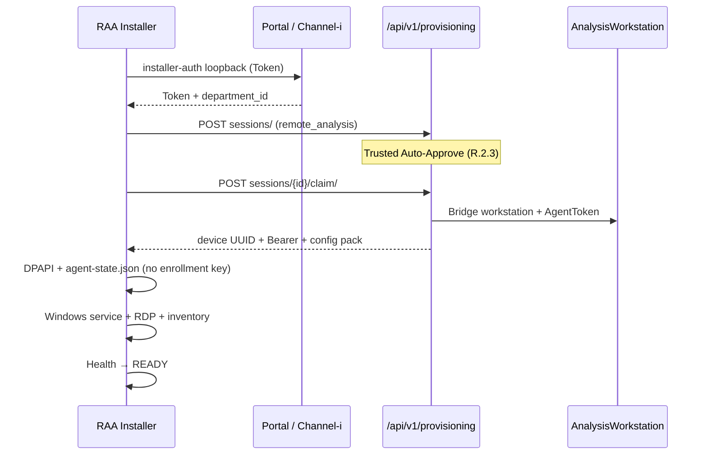

# R.2.5 — Remote Analysis Agent Zero-Touch Provisioning

**Status:** Implemented  
**Scope:** Remote Analysis Agent installer + portal Device Provisioning bridge  
**Does not modify:** Department Sync Agent, Equipment PC Wizard

---

## Objective

Administrator experience:

```
Download RAA → Install → Portal Login → Windows Admin Password → Provision → Finish
```

No Enrollment Key, UUID, API Token, Bootstrap Secret, or manual Workstation Registration on the standard path.

---

## Architecture



| Layer | Responsibility |
|-------|----------------|
| Portal | Auth, session, policy, claim pack, AnalysisWorkstation bridge |
| Installer | Login loopback, claim, DPAPI secrets, service, software scan |
| Agent service | Heartbeat / inventory using claimed Bearer |

---

## Installer flow

| Step | UI | Behavior |
|------|-----|----------|
| 1 Portal URL | Default `https://equip.iitr.ac.in` | HTTPS required |
| 2 Portal Login | Portal / Channel-i loopback | Reuse DPAPI session if present |
| 3 Provisioning | `POST /sessions/` `device_type=remote_analysis` | Trusted / Restricted / Manual / Device Code |
| 4 Windows Password | Local account only | DPAPI; service / RDP / firewall |
| 5 Configuration | Automatic | Heartbeat, tunnel, health, RA settings |
| 6 Software Scan | Registry + catalog | Name, version, publisher, hardware |
| 7 Health | Portal + service + local API | Display **READY** |

Enrollment key remains under **Advanced** (deprecated break-glass).

Silent (zero-touch):

```text
RemoteAnalysisAgentSetup.exe /silent /portal=https://equip.iitr.ac.in ^
  /sessionId=... /sessionProof=... /equipmentId=... /rdpPassword=...
```

Legacy `/enrollmentKey=` still accepted and deprecated.

---

## Portal APIs (R.2.5)

| Method | Path | Notes |
|--------|------|-------|
| POST | `/api/v1/provisioning/sessions/` | `device_type=remote_analysis` |
| GET | `/api/v1/provisioning/sessions/{id}/` | Poll with `X-Provisioning-Session-Proof` |
| POST | `/api/v1/provisioning/sessions/{id}/claim/` | Returns agent Bearer + `agent_id` / `workstation_id` |
| POST | `/api/v1/provisioning/devices/{id}/replace/` | Revoke RAA device for replacement PC |
| GET/POST | `/api/v1/analysis/installer/equipment-tree/` | Token / Bearer / legacy enrollment key |
| POST | `/api/v1/analysis/installer/link-equipment/` | Same auth modes |
| POST | `/api/v1/analysis/register/` | **Deprecated** legacy enroll |

Claim `configuration` includes: heartbeat, tunnel_policy, health_policy, remote_analysis_settings, `requires_windows_password`. **No enrollment key.**

On claim, portal bridges to `AnalysisWorkstation` and issues a standard AgentToken so existing heartbeat/inventory paths continue unchanged.

---

## Security

- No shared `RA_AGENT_ENROLLMENT_KEY` on the standard path
- Session proof / access token: memory + DPAPI (`ProgramData\RemoteAnalysisAgent\…`); never logged
- Agent credentials written to `State\agent-state.json` after claim; service restarted
- Windows password used only for local RDP / permissions; never printed
- Legacy register endpoint retained for already-enrolled agents

---

## Recovery / Advanced

| Action | How |
|--------|-----|
| Re-Provision | Sign in again → create session → claim (after revoke/replace if duplicate) |
| Replace Workstation | Portal `POST …/devices/{id}/replace/` then install on new PC |
| Factory Reset | Clear `ProgramData\RemoteAnalysisAgent` staging/state; re-run installer |
| Export Diagnostics | Installer log folder + local `http://127.0.0.1:5088/api/diagnostics` (no secrets) |
| Offline Diagnostics | Compatibility + local API health without portal |

---

## Audit

| Action | When |
|--------|------|
| `created` / `provisioning_started` | Session create |
| `policy_used` / `auto_approved` | Department policy |
| `provisioned` / `provision_completed` | Claim + RAA bridge |
| `heartbeat` | Device heartbeat |
| `device_replaced` | Replace workstation |
| `revoked` | Revocation |
| Software inventory | Analysis workstation inventory (agent Bearer) |

---

## Backward compatibility

- Existing enrolled RAA continues (Bearer in agent-state)
- Legacy `/api/v1/analysis/register/` + `X-Enrollment-Key` retained, deprecated
- Upgrade preserves Agent ID and ProgramData state

---

## Tests

Backend: `iic_booking/device_provisioning/tests/test_remote_analysis_r25.py`

| Case | Expected |
|------|----------|
| Trusted Auto-Approve | Approved → claim → workstation + token |
| Manual Approval | Pending until approve |
| Restricted Network | Pending when IP outside CIDR |
| Device Code | `device_code` returned |
| Duplicate Workstation | `400 duplicate_active_device` |
| Replace | Revoked → re-provision allowed |

---

## Troubleshooting

| Symptom | Check |
|---------|--------|
| Sign-in timeout | Allow loopback `127.0.0.1` listener; complete browser login |
| Pending forever | Portal → Device Provisioning → Approve, or fix department policy |
| Duplicate device | Replace old device or revoke fingerprint |
| Service not READY | Confirm `agent-state.json` has token; restart RemoteAnalysisAgent |
| Equipment tree empty | Enable Remote Analysis on equipment; verify Token auth |

---

## STOP / Next

R.2.5 does **not** modify DSA or Equipment Wizard.

Next: **PHASE R.3 — Complete Four-System Plug-and-Play Qualification**  
See `docs/release/phase-R3/R3-Four-System-Plug-and-Play-Qualification.md`.
