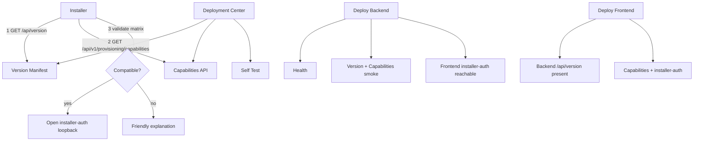

# R.2.6 — Version Compatibility and Deployment Hardening

| Field | Value |
|-------|--------|
| Phase | R.2.6 |
| Status | Implemented |
| Depends on | R.2.1–R.2.5 |
| Next | R.3 Four-System Live Plug-and-Play Qualification |

## Problem

DSA installer v1.0.1 correctly implemented zero-touch Portal Login, but production still served an older frontend without `/device-provisioning/installer-auth`. The installer opened a browser that reached a SPA 404. This class of **portal ↔ installer version mismatch** must not recur.

## Architecture

### Public endpoints

| Method | Path | Auth | Purpose |
|--------|------|------|---------|
| GET | `/api/version` | AllowAny | Portal / backend / frontend / provisioning / copilot / installer matrix |
| GET | `/api/v1/provisioning/capabilities/` | AllowAny | Zero-touch flags + optional `?product=&installer_version=` |
| GET | `/api/v1/provisioning/self-test/` | Admin (CanManageDepartmentSync) | Deployment diagnostics |

Static `/iic-device-provisioning.json` is **deprecated** (shim only). Installers must use the capabilities API.

### Installer preflight order

1. `GET /api/version`
2. `GET /api/v1/provisioning/capabilities/?product=…&installer_version=…`
3. Validate compatibility
4. Proceed to installer-auth **or** show a friendly message

Supported failure modes:

| Case | User-facing outcome |
|------|---------------------|
| Portal too old / missing endpoints | Upgrade portal to 2.5.2 R.2+ |
| Installer too old | Offer latest from Deployment Center |
| Provisioning disabled | Explain; contact admin |
| Portal unreachable | Check URL / network |

**Installer-auth loopback protocol is unchanged** (`return_to` → Token query).

## Compatibility Matrix (defaults)

| Product key | Minimum | Latest |
|-------------|---------|--------|
| `dsa` | 1.0.1 | 1.0.2 |
| `equipment_pc` | 1.0.0 | 1.0.0 |
| `remote_analysis` | 1.0.3 | 1.0.3 |

Override via env `SUPPORTED_INSTALLERS` JSON. Portal stamp via `PORTAL_VERSION`, `BACKEND_GIT_COMMIT` / `GIT_SHA`, `FRONTEND_VERSION`, `FRONTEND_GIT_COMMIT`, `BUILD_DATE`, `PROVISIONING_VERSION`, `COMPATIBLE_FRONTEND_MIN`, `COMPATIBLE_BACKEND_MIN`.

Traffic lights in Deployment Center:

| Color | Meaning |
|-------|---------|
| Green | Compatible |
| Yellow | Upgrade recommended |
| Red | Unsupported |

## Deployment Flow

1. Qualify backend release tag (Backend Release).
2. Deploy Backend (`backend-deploy.yml`):
   - compose up → analysis health
   - smoke `/api/version` + `/api/v1/provisioning/capabilities`
   - require frontend `/device-provisioning/installer-auth` reachable
   - optional `FRONTEND_VERSION` ≥ `COMPATIBLE_FRONTEND_MIN`
   - on failure → rollback to previous release tag
3. Deploy Frontend (`deploy.yml`):
   - `deploy-frontend.sh`
   - require backend `/api/version` + capabilities
   - probe installer-auth on the public SPA
4. Mark deployment successful only after smoke PASS.

## Self Test

Deployment Center → **Deployment Self Test** calls `/api/v1/provisioning/self-test/` and reports PASS/FAIL with per-check diagnostics (API version, frontend match, provisioning, installer-auth, capabilities, Research Copilot informational).

## Recovery / Rollback

- Backend: existing `.deploy-state/previous_release_tag` rollback in Deploy Backend.
- Frontend: redeploy last known-good `master` commit / prior artifact; do not leave SPA without installer-auth while backend advertises `installer_auth: true`.
- If capabilities advertise zero-touch but SPA route is missing → treat as deploy failure (frontend gate).

## Operational Checklist

- [ ] `GET https://<portal>/api/version` returns JSON with `supported_installers`
- [ ] `GET https://<portal>/api/v1/provisioning/capabilities/` has `installer_auth: true`
- [ ] `https://<portal>/device-provisioning/installer-auth` loads Installer Auth (not SPA 404)
- [ ] Deployment Center shows portal version + green/yellow/red per product
- [ ] DSA / Equipment / RAA preflight succeeds before browser open
- [ ] Deploy Backend and Deploy Frontend smokes PASS on runner
- [ ] Self Test overall PASS (hard checks)

## Regression coverage

Backend tests: `iic_booking/device_provisioning/tests/test_r26_compatibility.py`

- Portal version public
- Capabilities public / disabled provisioning
- Installer too old → red
- Self-test auth gate

Manual / CI:

- Portal older than installer
- Installer older than portal
- Missing capability endpoint
- Missing installer-auth route
- Provisioning disabled
- Backend/frontend mismatch
- Deploy rollback path

## STOP

After R.2.6 is deployed and verified, resume **Phase R.3 — Four-System Live Plug-and-Play Qualification** with Portal, Backend, Frontend, DSA, Equipment Wizard, and Remote Analysis Agent all on compatible versions.
