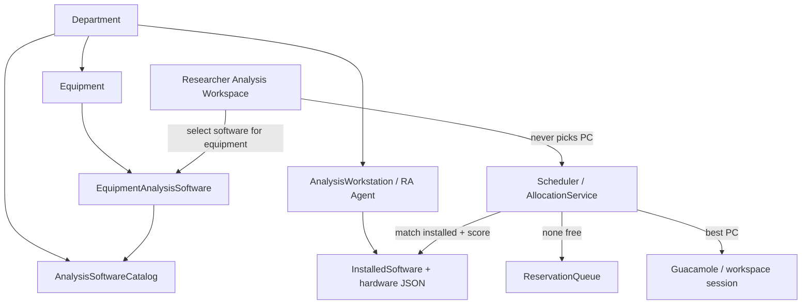

# R6.2 — Proposed Architecture

## Target topology

## Design rules

1. **Reuse** `AnalysisSoftwareCatalog`, `EquipmentAnalysisSoftware`, inventory sync, and `AllocationService`.  
2. **Do not** introduce a second catalog or permanent Equipment→PC ownership table.  
3. **Dual-read:** if no catalog mapping, fall back to equipment `analysis_profile` / workflow required software (existing `SoftwareMappingService.resolve`).  
4. **Optional pool:** `EquipmentAnalysisPool` remains soft preference unless an active `EQUIPMENT_PRIORITY` rule hard-filters.  
5. **Hide infrastructure:** APIs and UX must not expose RA hostname/IP to researchers (existing Analyze Data contract).

## Allocation policy (R6)

| Input | Hard requirement |
|-------|------------------|
| Workflow Analyze | Workflow mandatory software name list |
| User-selected catalog software | That software name (via resolved `SoftwareRequirement`) |
| No selection / legacy | Default mapping, else all mapped names, else `analysis_profile` |

Scoring continues to use health, load, software match weight, department affinity, GPU presence, idle time (`services/allocation.py`).

## Admin surfaces (reuse)

| Concern | Surface |
|---------|---------|
| Catalog CRUD | Django Admin `AnalysisSoftwareCatalogAdmin` |
| Equipment↔software | Django Admin `EquipmentAnalysisSoftwareAdmin` |
| Preferred PC pool | Django Admin `EquipmentAnalysisPoolAdmin` |
| Live inventory | SPA `/remote-analysis` Installed Software tab |
| Equipment RA toggles | SPA `EquipmentForm` + Django Admin |

## Compatibility

- Existing bookings, reservations, Guacamole sessions unchanged.  
- Installer catalog GET and inventory POST contracts unchanged.  
- Feature is additive: selection improves targeting; omitting selection still allocates.
